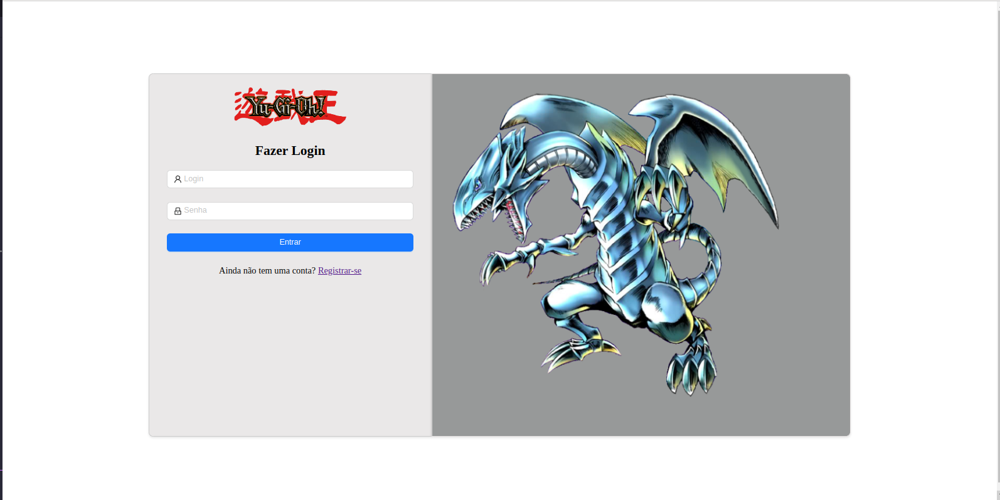

# Build your Deck  


## Sobre

Aplicação Front-end desenvolvida para que usuários possam criar o seu perfil e monta varios decks de yu-gi-oh.


## Requisitos de software 

  


## Procedimentos de execução sem docker


Clone o projeto via SSH ou HTTPS

Via SSH

```bash
git clone https://github.com/RodrigoGuedelho/build-yugioh-deck-frontend.git
```


Com o projeto clonado, acesse o diretório e instale todas as dependências necessárias

```bash
cd build-yugioh-deck-frontend
yarn
```


Inicie a aplicação para desenvolvimento

```bash
yarn next dev
```

Gerar build da aplicação

```bash
yarn next build

Gerar Iniciar aplicação após build

```bash
yarn next start

Acesse  localhost na porta 3000 




### Procedimentos de execução com docker


> Os procedimentos para execução da aplicação através do docker requer os arquivos **Dockerfile** e **docker-compose.yml**


Para construir a  imagem Node e montar as instruções de linhas de comando que serão executadas de acordo com o contexto de produção, execute o seguinte comando do **docker-compose**: 

```bash
docker-compose build
```


Após o build, para iniciar o contâiner, execute:

```bash
docker-compose up
```


Para iniciar o contâiner em modo background, execute:

```
docker-compose up -d
```


